# Procesverslag
Markdown is een simpele manier om HTML te schrijven.  
Markdown cheat cheet: [Hulp bij het schrijven van Markdown](https://github.com/adam-p/markdown-here/wiki/Markdown-Cheatsheet).

Nb. De standaardstructuur en de spartaanse opmaak van de README.md zijn helemaal prima. Het gaat om de inhoud van je procesverslag. Besteedt de tijd voor pracht en praal aan je website.

Nb. Door *open* toe te voegen aan een *details* element kun je deze standaard open zetten. Fijn om dat steeds voor de relevante stuk(ken) te doen.

## Jij

  
uitwerken voor kick-off werkgroep

  ### Auteur:
  Mels van den Bovenkamp
  #### Je startniveau:
  Blauw
  #### Je focus:
  Responsive

## Je website

  
uitwerken voor kick-off werkgroep

  ### Je opdracht:
  link naar de website die je gaat namaken óf de naam/omschrijving van je eigen ontwerp
  https://www.coolblue.nl

  #### Screenshot(s) van de eerste pagina (small screen): 
  Home pagina  
  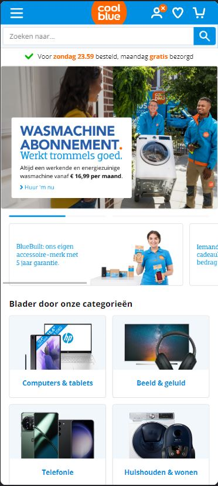
  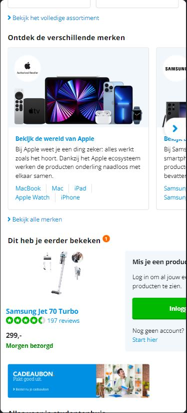
  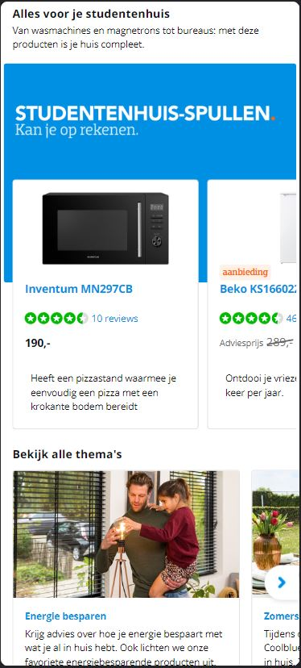
  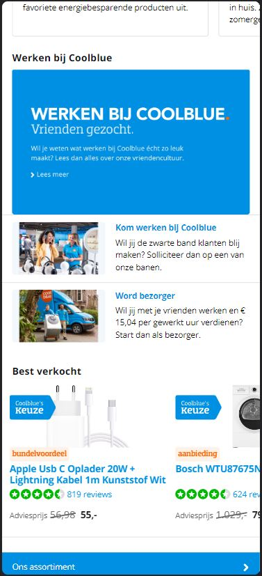
  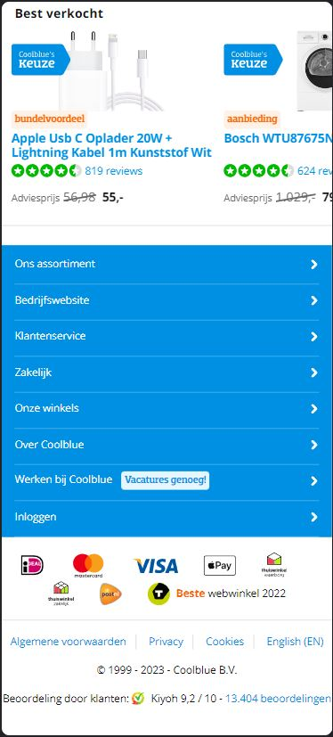

  #### Screenshot(s) van de tweede pagina (small screen):
  Samsung Jet 70 pro  
  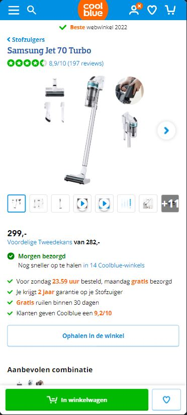
  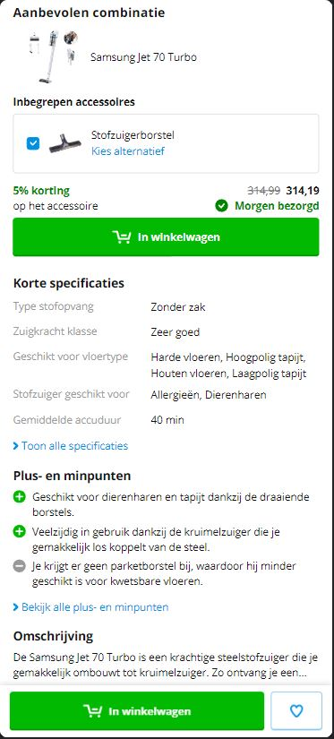
  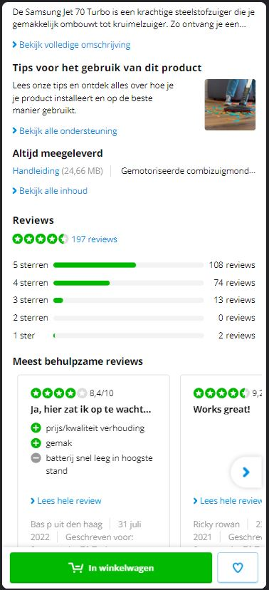
  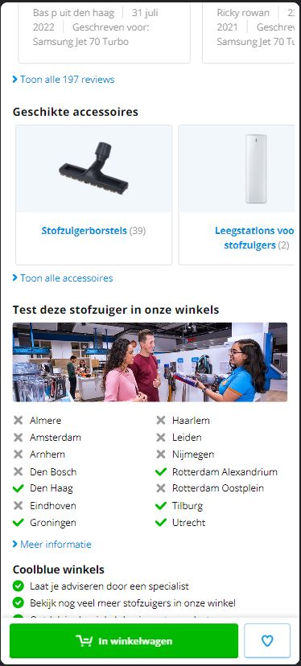
  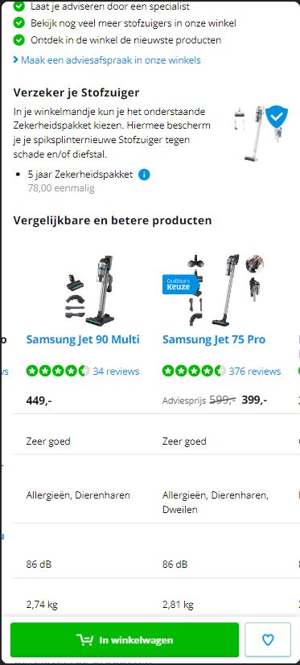
  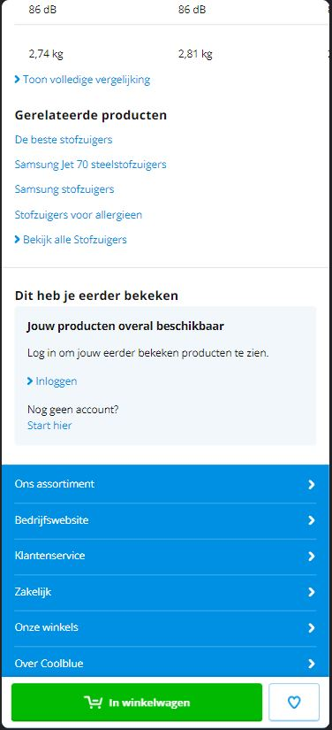
 

## Toegankelijkheidstest 1/2 (week 1)

  
uitwerken na test in 2e werkgroep

  ### Bevindingen
  Images hebben geen alt tags.
  Er gaan ook wat dingentjes mis bij de links en buttons. 
  Ook zitten er in de website zelf geen manieren om het uiterlijk van de website aan te passen.
  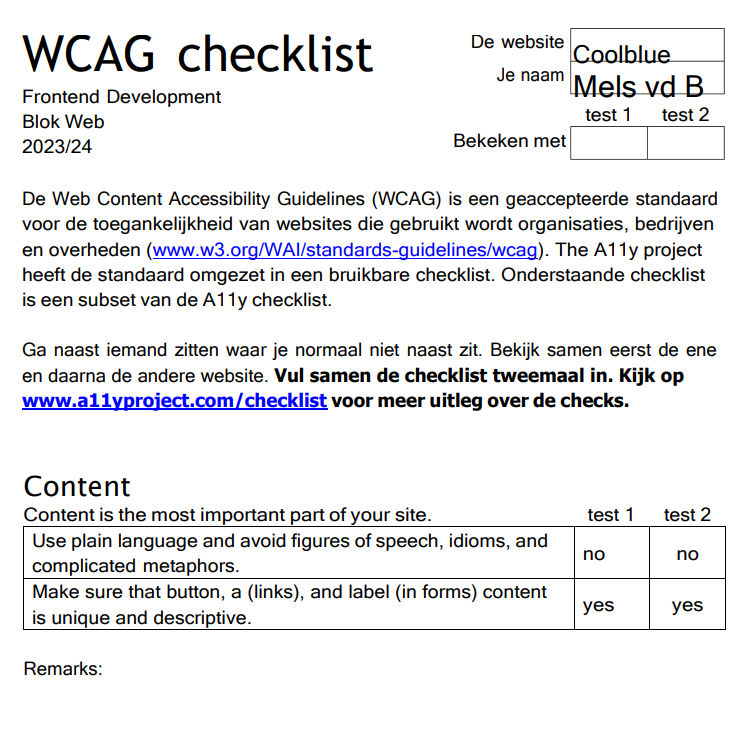
  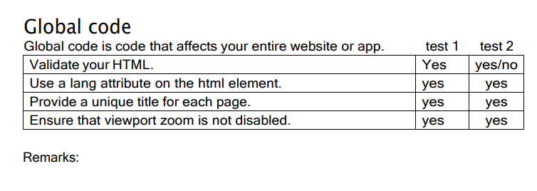
  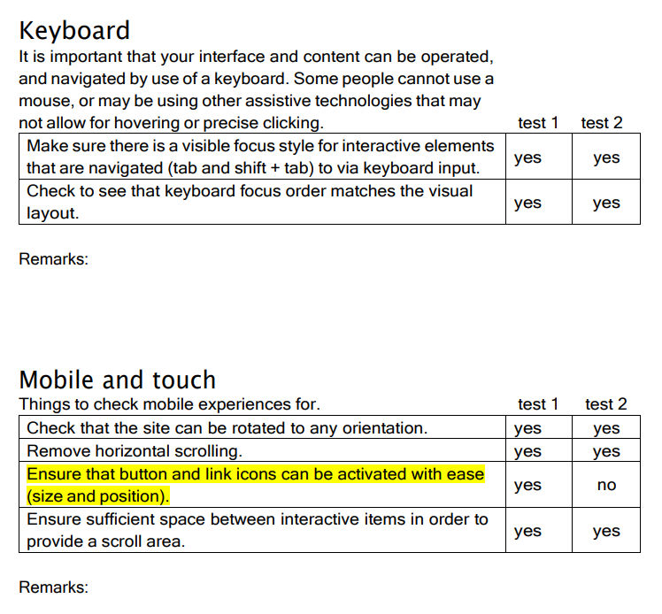
  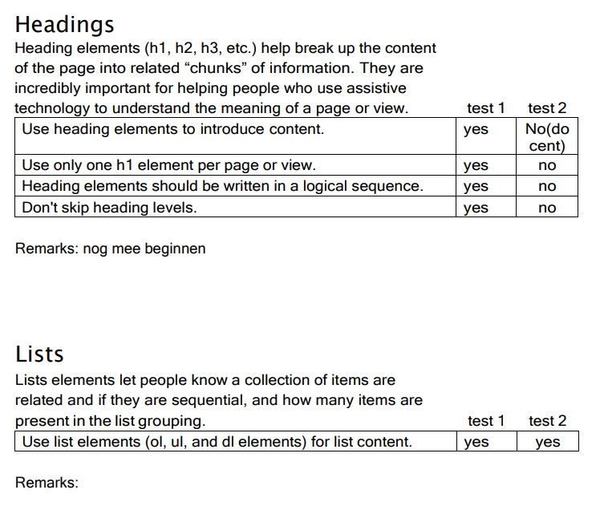
  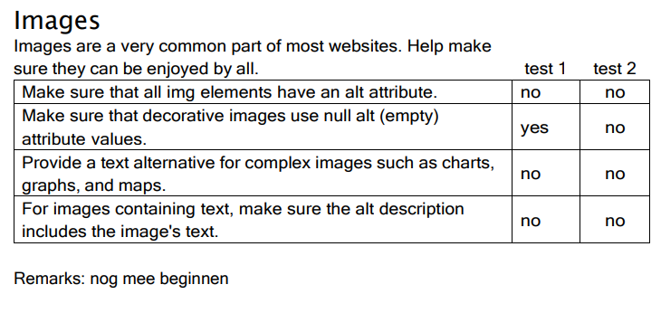
  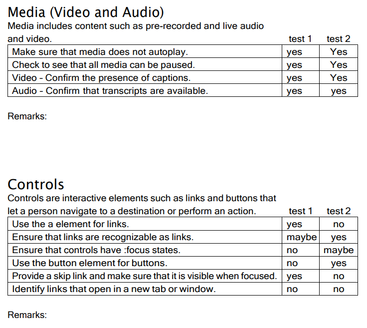
  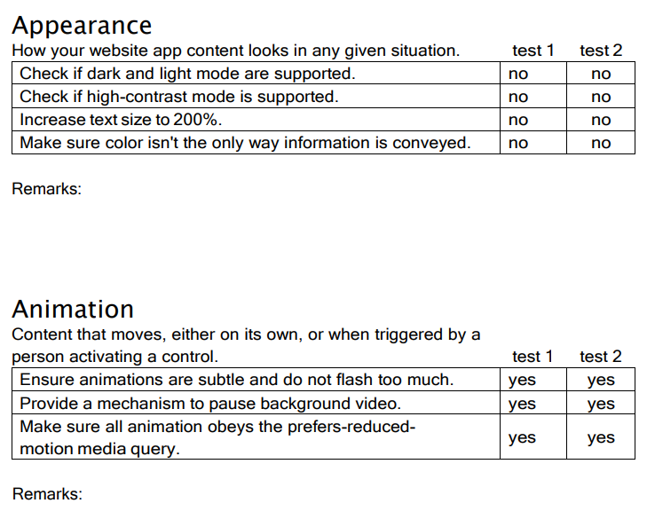
  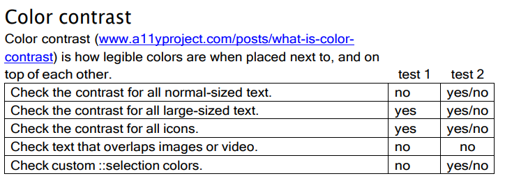

## Breakdownschets (week 1)

  
uitwerken na afloop 3e werkgroep

  ### de hele pagina: 
  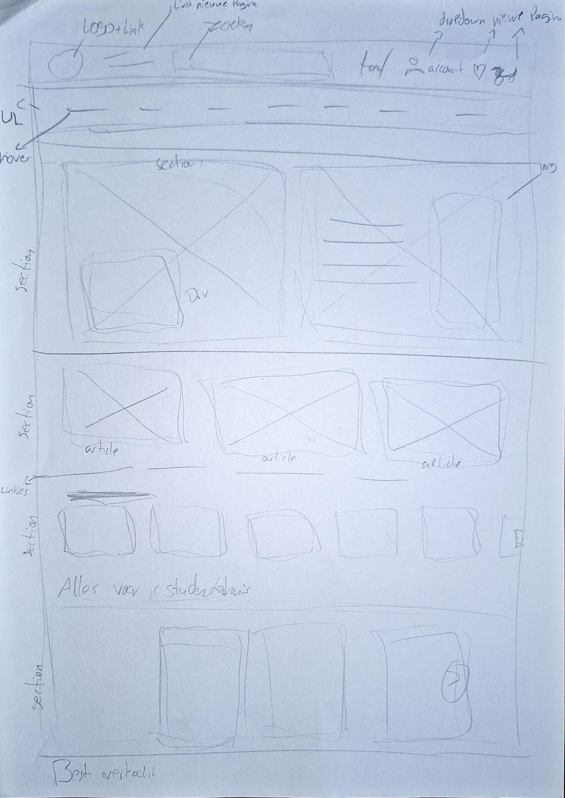

## Voortgang 1 (week 2)

  
uitwerken voor 1e voortgang

  ### Stand van zaken
  Ik vond het lastig om een goede start te maken, ik wist niet echt waar ik moest beginnen. Uiteindelijk was ik begonnen met al mijn html uit te schrijven. Dit heb ik gedaan door te kijken naar wat ik kon zien op de website. Maar dit deed ik door te kijken naar de grote versie van de website. Het stond daarom dus in de volgorde van de computer versie. Maar omdat ik er later in de les achterkwam dat we moesten beginnen op een telefoonscherm (zelf niet goed onthouden). Aangezien mijn website best wel veranderd van computer naar telefoon versie vond ik het lastig om te snappen waar ik moest beginnen met mijn menu. Dat is ook waar de grootste verandering in zat. Ik ben veel in gesprek geweest met de docent over hoe ik het moest doen. Ik vond het lastig om hier echt iets van te begrijpen, zeker ook omdat ik na de vakantie best weer een beetje moest inkomen met coderen. 
  Na een heletijd strugglen en het eigenlijk nog niet snappen hoe het menu zou moeten werken heb ik maar besloten om te beginnen met de andere elementen. Het was eventjes zoeken en bedenken hoe het ookalweer werkte en welke CSS elementen er waren maar dat kwam als snel weer terug. Ik had snel het eerste element nagemaakt en het leek heel erg op de echte versie. Daar was ik best trots op. Ik ben daarna verder gegaan met 2 andere elementen omdat ik nog niet klaar was voor het menu. 

  ### Agenda voor meeting
  samen met je groepje opstellen
  We hebben niks besproken om de meeting voor te bereiden. Ook waren de groepjes een beetje in de war, dus zat ik niet bij mijn eigen.

  | student 1      | student 2          | student 3    | student 4        |
  | ---            | ---                | ---          | ---              |
  | dit bespreken  | en dit             | en ik dit    | en dan ik dat    |
  | en dat ook nog | dit als er tijd is | nog een punt | dit wil ik zeker |
  | ...            | ...                | ...          | ...              |

  ### Verslag van meeting

 Ik heb tijdens de meeting nog meer uitleg gekregen over hoe ik het menu moet aanpakken. Ik heb er veel aan gehad, maar het was nog net niet genoeg voor mijzelf om de stap te zetten om er weer mee aan de slag te gaan. Ik heb daarom maar die 2 andere elementen afgemaakt. 

## Voortgang 2 (week 3)

  
uitwerken voor 2e voortgang

  ### Stand van zaken
  Ik was begonnen aan mijn menu. Ik vondt het nogsteeds lastig om het uiteindelijk allemaal goed op zijn plaats te zetten. Daar heb ik veel tijd in zitten. Ik heb tijdens de les nog wat advies gevraagd aan Lanxiang maar zij deed het op een andere manier waardoor ik daar dus niet heel veel aan had want anders moest ik het hele menu opnieuw maken.
  Ook had ik mijn CSS nog niet helemaal goed geordend dus moest ik dat ook nog doen om te zorgen dat zodra het veel meer CSS werdt dat ik het nog wel zou snappen.

  ### Agenda voor meeting
  Er waren nog weinig mensen in de klas, ik kreeg eerst feedback van de student assistent in een groepje. Ik moest op een paar
  dingentjes letten maar ik weet nietmeer wat. Ik heb dit wel na het feedback aangepakt. Daarna heb ik nog individueel feedback gekregen
  van de docent over mijn menu en algemeen wat andere dingen. 

  | student 1      | student 2          | student 3    | student 4        |
  | ---            | ---                | ---          | ---              |
  | dit bespreken  | en dit             | en ik dit    | en dan ik dat    |
  | en dat ook nog | dit als er tijd is | nog een punt | dit wil ik zeker |
  | ...            | ...                | ...          | ...              |

  ### Verslag van meeting
  Ik moet nog best wel veel doen, en verder met mijn menu, want dat is wel iets belangrijks van de website.

## Toegankelijkheidstest 2/2 (week 4)

  
uitwerken na test in 9e werkgroep

  ### Bevindingen
  Ik moet nog heel veel aanpassen, ik ben ook nog niet klaar met de html en css van mijn website. 
  Ik heb nog wat problemen zitten in de grootte van knoppen, ook moet ik nog goed kijken naar de volgorde van mijn headings.
  Ook moet ik nog alt text toevoegen aan mijn images. Daarnaast moet ik ook kijken naar mijn buttons/links.

  De afbeeldingen van de Toegankelijkheidstest zijn hetzelfde als de eerste.
  
  
  
  
  
  
  
  
  

## Voortgang 3 (week 4)

  
uitwerken voor 3e voortgang

  ### Stand van zaken
  Ik heb de eerste les van deze week helaas een beetje verspilt. Dit heb ik niet expres gedaan maar omdat ik een extra tabje wilde openen in mijn menu. Ik moest hierdoor extra code toevoegen aan mijn Html. Ik had bedacht dit op een bepaalde manier te doen maar dit pakte niet helemaal goed uit. Ik moest ook bestaande elementen aanpassen. Uiteindelijk was ik erg ver gekomen maar door het geknoei met andere elementen moest ik mijn CSS aanpassen. Maar ik zag door de bomen het bos nietmeer dus heb ik de docent er bij gehaald. Hij heeft mij verteld hoe het moest en eigenlijk moest ik dus alles wat ik daarvoor gedaan had weer weghalen. Ik ben echt heel erg dankbaar dan Visual Studio Code een Timeline functie heeft want als dat niet zo was dan wist ik nietmeer hoe ik het terug moest zetten. Uiteindelijk aan het einde van de les liep ik het lokaal uit met de website in ongeveer dezelfde staat als dat ik het lokaal binnen liep aan het begin van de dag. Gelukkig liep ik wel met meer kennis naar buiten en kon ik thuis aan de slag en is het uiteindelijk gelukt op de manier van de docent.

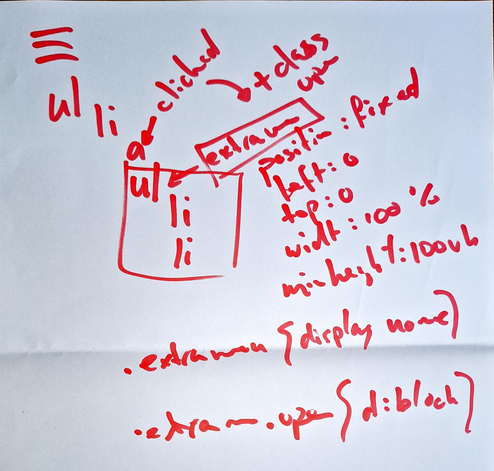
  

  De tweede les van de week begon ik hem wel een beetje te knijpen over of ik het wel optijd af zou krijgen. Ik wist dat ik nog wat dingen moest doen aan mijn eerste pagina en aan mijn menu. Daarnaast moest ik ook nog de 2e pagina maken en nog zorgen dat de screenreader en toegankelijkheid allemaal klopte. Ik had dus nog veel te doen. Ik heb dit in de les met de docent besproken dat het niet super erg zou zijn als niet alles af is omdat ik het dan kon herkansen (aanvullen). Dat ik dat eind gesprek dan kon zien als feedback moment, dat stelde mij wel gerust dus dat vond ik fijn. 

  Ik had nog wat problemen met mijn laatste element op de eerste pagina, ik zag eventjes nietmeer hoe ik dat op een makkelijke manier kon maken. Uiteindelijk met wat uitleg van de docent ben ik er uitgekomen en heb ik er voor gekozen om gewoon een blauw vlak te gebruiken en niet een afbeelding. 

  ### Agenda voor meeting
  Ik heb niks met een groepje besproken.

  | student 1      | student 2          | student 3    | student 4        |
  | ---            | ---                | ---          | ---              |
  | dit bespreken  | en dit             | en ik dit    | en dan ik dat    |
  | en dat ook nog | dit als er tijd is | nog een punt | dit wil ik zeker |
  | ...            | ...                | ...          | ...              |

  ### Verslag van meeting
  Voor mij is het de bedoeling dat ik eerst zorg dat mijn website werkt en dan zorgen maken over de rest.

## Eindgesprek (week 5)

  
uitwerken voor eindgesprek

  ### Je uitkomst - karakteristiek screenshots:
  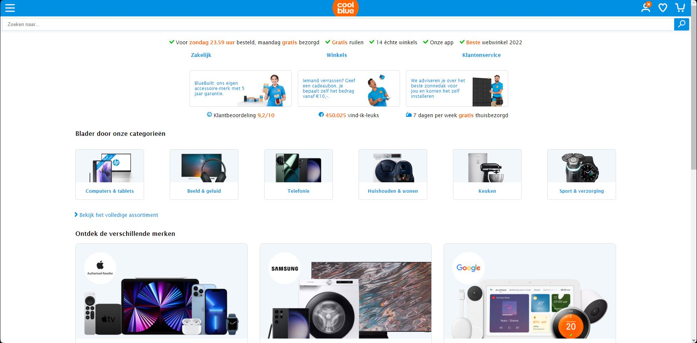
  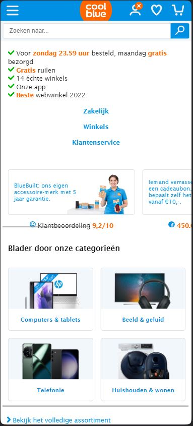
  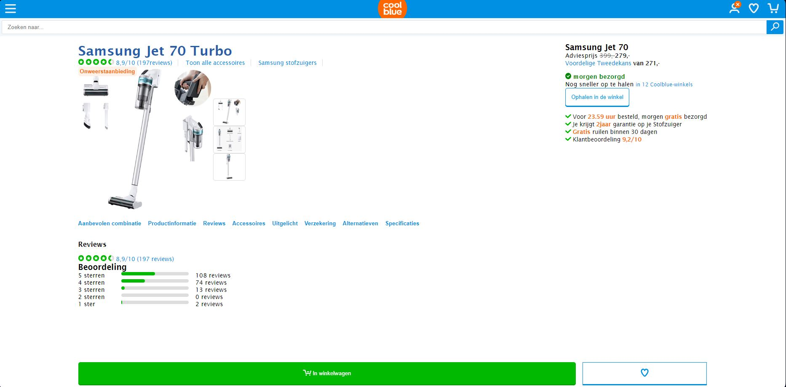
  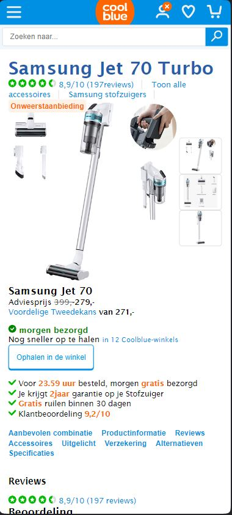
  

  ### Dit ging goed/Heb ik geleerd: 
  Het ging opzich goed om de elementen te bouwen, en dat deze er dan ook uizagen zoals op de echte website.
  Uiteindelijk ben ik best tevreden met de responsiveness van mijn website. Ik heb erg veel mee geklooit maar uiteindelijk is dat goed gekomen.
  Op het einde heb ik nog eventjes snel een 2e javascript bestandje gemaakt omdat een deel in de weg stond voor het andere, eerst dacht ik dat het andersom zetten het zou oplossen, dat werkte ook, maar dan deed hij het nietmeer op die andere pagina. Ik was best wel trots op mijzelf dat ik het probleem zo snel had gevonden en wist op te lossen.

  ### Dit was lastig/Is niet gelukt:
Ik had problemen met mijn menu in het begin omdat ik niet goed kon bedenken en het voor mij zien van hoe ik zo iets moest maken omdat er best wel veel veranderde in het menu op de echte site als je de breedte groter of kleiner maakte. Daarnaast heb ik erg veel problemen gehad met de screenreader. Hij wilde sommige dingen niet voorlezen. Hij las rare dingen voor als ik op een item zat, en dan ging ik heen en terug om te herluisteren en dan zei die het een paar keer hetzelfde en daarna nietmeer. Ook werdt ik helemaal gek van de screenreader omdat ik hem steeds aan en uit moest zetten om een klein dingentje aan te passen. Ik heb problemen gehad met het responsive maken van de website omdat ik er niet echt uit kon komen hoe ik de items wilde hebben staan. Hier ben ik uiteindelijk wel uitgekomen maar dat heeft wel even geduurt. 

## Bronnenlijst

  
continu bijhouden terwijl je werkt

 
  1. https://developer.mozilla.org/en-US/docs/Web/Accessibility/ARIA/Attributes/aria-label
  2. https://blog.hubspot.com/website/html-strikethrough
  3. https://developer.mozilla.org/en-US/docs/Web/CSS/filter-function/drop-shadow
  4. https://codepen.io/shooft/pen/NWePYRO
  5. https://developer.mozilla.org/en-US/docs/Web/API/Element/scrollLeft

  Nb. Wees specifiek ('css-tricks' als bron is bijv. niet specifiek genoeg). 
  Nb. ChatGpT en andere AI horen er ook bij.
  Nb. Vermeld de bronnen ook in je code.

